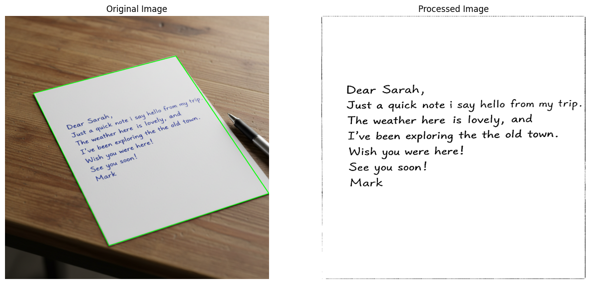

# Document Scanning and Preprocessing

This project implements a program to scan and preprocess a document image using OpenCV. The script detects the edges of a document, performs perspective transformation to correct the document's orientation, and applies adaptive thresholding to enhance the text.

---

## Demo

This is a demo of how this program works. The program automatically detects the outline of the document and highlights it in green, then after correctking the document's orientation and enhancing the text, shows the output.



---

## Features

- **Edge Detection**:
  - Uses the Canny edge detector to identify the edges of the document.

- **Contour Detection**:
  - Finds and sorts contours to detect the outline of the document.

- **Perspective Transformation**:
  - Corrects the document's orientation by transforming it to a top-down view.

- **Adaptive Thresholding**:
  - Enhances the document's text using adaptive thresholding.

- **Visualization**:
  - Displays the original+highlighted outline and processed images side by side.

---

## Usage

0. Clone or download this repository

```bash
git clone https://github.com/Mahdi-Razi-Gandomani/camScanner.git
cd camScanner
```

1. Place your input image in the `images/` directory (default filename: `input.png`).

2. Run the script:

```bash
python3 camScanner.py
```
3. After running the script, you should see two images side by side.
   
  - The input image with the detected document contour highlighted in green.
  - The warped, perspective-corrected, and thresholded output.
